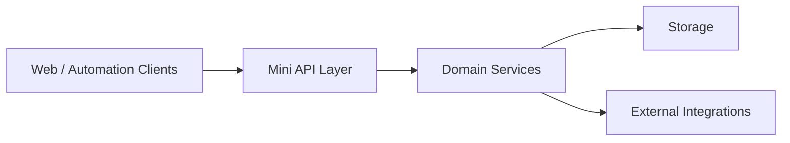

# Codestech Mini API

## Overview

Codestech Mini API is a lightweight product infrastructure layer used to support modular service experiments, internal product operations and integration-first delivery.

## Problem

Early-stage digital products often need a practical backend layer before larger platform decisions are finalized.

## Solution

This API case represents a lean service foundation that can host endpoints, internal logic, adapters and validation flows needed across product initiatives.

## Target Users

- Internal product initiatives
- Automation and integration workflows
- Experimental features and service modules

## Key Features

- Lightweight service foundation
- REST-oriented integration layer
- Modular backend structure
- Support for product experiments
- Documentation-first portfolio representation

## Product Architecture

## Tech Stack

- Frontend: not applicable
- Backend: Python, FastAPI
- Database: SQLite, PostgreSQL, to be confirmed
- Automation / AI: to be confirmed
- Deploy: to be confirmed

## My Role

- Product Owner
- Founder / Product Builder
- Functional Architect
- Backlog and roadmap owner
- AI workflow designer
- Documentation and implementation lead

## Business Value

Provides a flexible technical base for fast iteration, integration testing and product-layer consolidation.

## Status

In development

## Roadmap

- Clarify public-safe architecture diagram
- Consolidate reusable modules for future product cases
- Confirm which portfolio screenshots can be sanitized and published

## Screenshots / Demo

To be added.

## Confidentiality Note

This public case study does not include private source code, credentials, production data or client-sensitive information.
