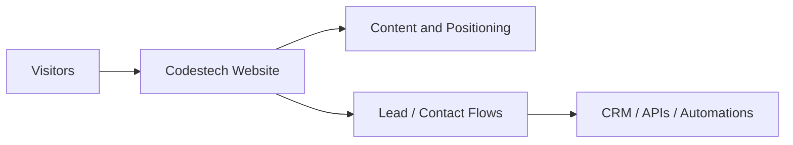

# Codestech Website

## Overview

Codestech Website is the public-facing brand and conversion layer intended to position Codestech services, products and implementation capabilities.

## Problem

A product and implementation business needs a clear web presence that communicates positioning, creates trust and converts interest into qualified opportunities.

## Solution

The website case focuses on brand storytelling, service presentation, product credibility and conversion paths connected to lead capture or contact flows.

## Target Users

- Prospective clients
- Partners
- Recruiters and collaborators

## Key Features

- Public positioning and messaging
- Product and service presentation
- Conversion-oriented contact paths
- Brand support for LinkedIn and outbound presence

## Product Architecture

## Tech Stack

- Frontend: React, TypeScript, Vite, HTML, CSS, to be confirmed
- Backend: to be confirmed
- Database: to be confirmed
- Automation / AI: to be confirmed
- Deploy: Vercel, to be confirmed

## My Role

- Product Owner
- Founder / Product Builder
- Functional Architect
- Backlog and roadmap owner
- AI workflow designer
- Documentation and implementation lead

## Business Value

Creates a structured public layer for trust, market positioning and opportunity generation.

## Status

To be confirmed

## Roadmap

- Confirm public stack details
- Add sanitized screenshots of key pages
- Tie the website case more explicitly to lead and portfolio flows

## Screenshots / Demo

To be added.

## Confidentiality Note

This public case study does not include private source code, credentials, production data or client-sensitive information.
