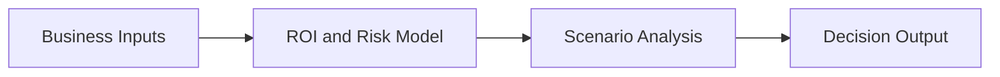

# Dora ROI Builder

## Overview

Dora ROI Builder is a strategic product concept oriented toward ROI framing, risk visibility and structured decision support in compliance-adjacent contexts.

## Problem

Leaders often need to justify compliance or transformation initiatives without a clear bridge between regulatory requirements, business impact and investment logic.

## Solution

The concept frames decisions through structured inputs, scenario thinking and business-friendly outputs that can support prioritization and investment discussions.

## Target Users

- Founders and business leaders
- Compliance and risk stakeholders
- Teams evaluating transformation initiatives

## Key Features

- ROI framing support
- Risk and compliance decision structure
- Business-oriented output design
- Potential for AI-assisted recommendation layers

## Product Architecture

## Tech Stack

- Frontend: to be confirmed
- Backend: to be confirmed
- Database: to be confirmed
- Automation / AI: AI-assisted analysis, to be confirmed
- Deploy: to be confirmed

## My Role

- Product Owner
- Founder / Product Builder
- Functional Architect
- Backlog and roadmap owner
- AI workflow designer
- Documentation and implementation lead

## Business Value

Helps turn abstract compliance or transformation discussions into clearer business cases with stronger executive readability.

## Status

Concept

## Roadmap

- Confirm problem framing and target vertical
- Add conceptual screen or workshop artifact
- Define decision outputs and KPI logic

## Screenshots / Demo

To be added.

## Confidentiality Note

This public case study does not include private source code, credentials, production data or client-sensitive information.
