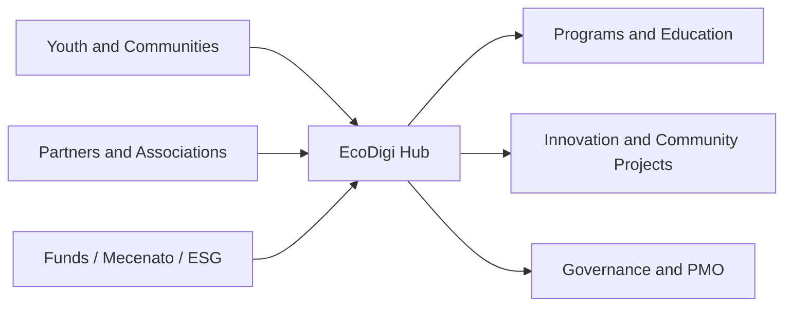

# EcoDigi Lab Portugal

## Overview

EcoDigi Lab Portugal is a strategic concept for a modular hub focused on digital education, sustainability, youth activation and social impact.

## Problem

Many territories and communities need innovation structures that connect digital inclusion, employability, sustainability, education and partnership-driven execution, but lack an integrated model to make that practical and fundable.

## Solution

The concept combines education, community activation, partnership logic, public funding, mecenato and ESG-oriented framing into a hub model that can be presented to institutions, partners and ecosystems.

## Target Users

- Young people and emerging talent
- Associations, municipalities and institutional partners
- Sponsors, consortium members and ESG-aligned stakeholders

## Key Features

- Modular innovation hub structure
- Digital education and activation logic
- Sustainability and social impact framing
- Partnership and consortium model
- Public funding and mecenato alignment

## Product Architecture

## Tech Stack

- Frontend: to be confirmed
- Backend: to be confirmed
- Database: to be confirmed
- Automation / AI: AI-assisted structure and documentation, to be confirmed
- Deploy: to be confirmed

## My Role

- Product Owner
- Founder / Product Builder
- Functional Architect
- Backlog and roadmap owner
- AI workflow designer
- Documentation and implementation lead

## Business Value

Positions a social-impact concept in a way that is more executable, fundable and understandable for institutions, partners and strategic collaborators.

## Status

Concept

## Roadmap

- Confirm target geography and operating partners
- Consolidate governance, funding and implementation layers
- Add sanitized executive visuals for public presentation

## Screenshots / Demo

To be added.

## Confidentiality Note

This public case study does not include private source code, credentials, production data or client-sensitive information.
