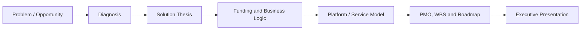

# Funding Portfolio OS / P01

## Overview

Funding Portfolio OS / P01 is a strategic portfolio case for structuring investment-ready and funding-ready projects with product logic, PMO discipline, delivery sequencing and executive presentation.

## Problem

Strong ideas frequently fail to advance because they are not translated into a structured project with thesis, funding logic, roadmap, governance and presentable material for stakeholders.

## Solution

This case organizes a project from problem framing to executive output, combining territorial strategy, funding readiness, software logic, PMO structure, WBS, budget and roadmap.

## Target Users

- Founders and project sponsors
- Institutional partners
- Municipalities, associations or ecosystem actors
- Stakeholders evaluating strategic initiatives

## Key Features

- Funding-oriented project structuring
- Executive narrative and business framing
- PMO and WBS logic
- Budget and viability layers
- Roadmap and delivery sequencing

## Product Architecture

## Tech Stack

- Frontend: executive HTML, documentation, to be confirmed
- Backend: not applicable
- Database: not applicable
- Automation / AI: AI-assisted structuring and documentation, to be confirmed
- Deploy: GitHub Pages, Vercel, to be confirmed

## My Role

- Product Owner
- Founder / Product Builder
- Functional Architect
- Backlog and roadmap owner
- AI workflow designer
- Documentation and implementation lead

## Business Value

Turns strategic ideas into executable, discussable and fundable initiatives with clearer decision quality and stronger stakeholder communication.

## Status

Concept

## Roadmap

- Consolidate project-to-project methodology patterns
- Add more executive HTML cases into the portfolio
- Define a reusable portfolio operating model for future strategic initiatives

## Screenshots / Demo

To be added.

## Confidentiality Note

This public case study does not include private source code, credentials, production data or client-sensitive information.
