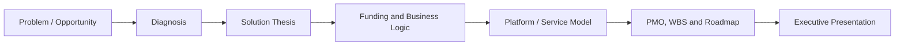

# Funding Portfolio OS / P01

## Executive Summary

Funding Portfolio OS / P01 is a strategic structuring case for turning strong ideas into funding-ready and execution-ready initiatives. It combines product reasoning, PMO logic, WBS discipline, delivery framing and executive communication in a single documentation-first portfolio asset. The public case focuses on methodology, not proprietary implementation.

## Business Context

High-potential initiatives frequently stall because they are not translated into a structure that investors, partners, institutions or internal stakeholders can evaluate confidently. Without a coherent narrative, roadmap and viability layer, promising ideas remain abstract.

## Product Challenge

The challenge was to organize a repeatable model that connects diagnosis, thesis, business logic, platform reasoning, roadmap and PMO structure into a presentable executive artifact.

## Product Response

The solution frames Funding Portfolio OS / P01 as a strategic operating model for structured project creation. It connects problem framing, opportunity diagnosis, solution thesis, funding logic, roadmap sequencing and final executive presentation into a decision-ready flow.

## High-Level Architecture

## Target Users

- Founders and project sponsors
- Institutional partners
- Municipalities, associations or ecosystem actors
- Stakeholders evaluating strategic initiatives

## Key Features

- Funding-oriented project structuring
- Executive narrative and business framing
- PMO and WBS logic
- Budget and viability layers
- Roadmap and delivery sequencing

## Tech Stack

- Frontend: executive HTML, documentation, `to be confirmed`
- Backend: not applicable
- Database: not applicable
- Automation / AI: AI-assisted structuring and documentation, `to be confirmed`
- Deploy: GitHub Pages, Vercel, `to be confirmed`

## Product Role

Adriano's role in this case is positioned across:

- Product Owner
- Founder / Product Builder
- Functional Architect
- Backlog and roadmap owner
- AI workflow designer
- Documentation and implementation lead

## Business Value

This case demonstrates how strategic ideas can be converted into clearer, more discussable and more executable initiatives through stronger structure, governance logic and executive communication.

## Expected Impact / Projected KPIs

- Improve decision clarity
- Increase operational visibility at the planning stage
- Support faster transition from strategy to structured action
- Improve stakeholder readability across funding and delivery logic
- Target metric to be validated: shorten project structuring cycles after methodology reuse

## Status

Concept

## Roadmap

- Consolidate project-to-project methodology patterns
- Add more executive HTML cases into the portfolio
- Define a reusable portfolio operating model for future strategic initiatives

## Screenshots / Demo

To be added.

## Confidentiality Note

This public case study does not include private source code, credentials, production data, internal endpoints or client-sensitive information.
