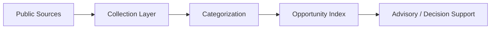

# Funding Radar / Portugal 2030

## Overview

Funding Radar / Portugal 2030 is a concept case for monitoring funding notices, categorizing opportunities and helping organizations keep track of relevant public programs.

## Problem

Funding opportunities are dispersed across multiple notices and sources, making continuous monitoring and prioritization time-consuming.

## Solution

The concept organizes notice tracking into a radar model with collection, categorization, status visibility and prioritization support.

## Target Users

- Consultants and advisors
- Organizations pursuing public funding
- Teams monitoring GovTech or incentive opportunities

## Key Features

- Notice monitoring
- Categorization and prioritization
- Status tracking
- Opportunity visibility support

## Product Architecture

## Tech Stack

- Frontend: to be confirmed
- Backend: to be confirmed
- Database: to be confirmed
- Automation / AI: research workflows, parsing, monitoring, to be confirmed
- Deploy: to be confirmed

## My Role

- Product Owner
- Founder / Product Builder
- Functional Architect
- Backlog and roadmap owner
- AI workflow designer
- Documentation and implementation lead

## Business Value

Reduces manual research effort and helps translate public notices into a more actionable monitoring workflow.

## Status

Concept

## Roadmap

- Confirm target user persona and frequency model
- Add a sanitized index screenshot
- Define alerting or prioritization logic for a future MVP

## Screenshots / Demo

To be added.

## Confidentiality Note

This public case study does not include private source code, credentials, production data or client-sensitive information.
