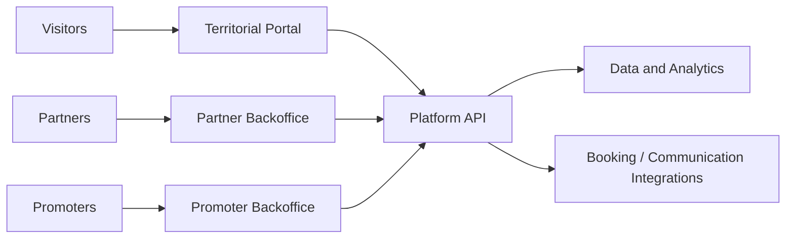

# Geres Digital Experience Network

## Overview

Geres Digital Experience Network is a strategic platform concept for connecting visitors, local partners and territorial promoters through a coordinated digital experience layer.

## Problem

Tourism ecosystems often lack a unified digital structure that helps visitors discover experiences while enabling local partners and promoters to coordinate offers and visibility.

## Solution

The concept proposes a platform with public discovery, partner backoffice, promoter operations, booking-adjacent handoff and territorial analytics.

## Target Users

- Visitors and tourists
- Local hospitality and experience partners
- Regional associations or municipalities

## Key Features

- Public discovery portal
- Partner backoffice
- Promoter administration
- Lead or booking handoff
- Territorial dashboards and analytics

## Product Architecture

## Tech Stack

- Frontend: web platform, to be confirmed
- Backend: APIs and service layer, to be confirmed
- Database: territorial data store, to be confirmed
- Automation / AI: analytics and integrations, to be confirmed
- Deploy: to be confirmed

## My Role

- Product Owner
- Founder / Product Builder
- Functional Architect
- Backlog and roadmap owner
- AI workflow designer
- Documentation and implementation lead

## Business Value

Supports destination-level digital coordination, improves partner visibility and creates a structured path for territorial experience management.

## Status

Concept

## Roadmap

- Confirm the target governance model
- Add sanitized conceptual diagrams and screenshots
- Define MVP scope for partners, offers and analytics

## Screenshots / Demo

To be added.

## Confidentiality Note

This public case study does not include private source code, credentials, production data or client-sensitive information.
