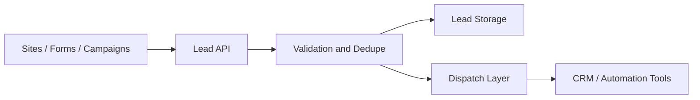

# Codestech Lead API

## Overview

Codestech Lead API is a centralized lead intake and distribution product designed to receive, validate and route leads from websites, forms and campaigns.

## Problem

Many lead capture setups depend on fragile direct webhooks or CRM-specific form handlers, which creates duplication, routing inconsistency and operational noise.

## Solution

The API acts as a stable first entry point for incoming leads. It standardizes payload validation, applies anti-duplication logic and dispatches clean data into downstream workflows.

## Target Users

- Marketing and growth operations
- CRM-driven sales teams
- Implementation projects connecting websites and automations

## Key Features

- Centralized lead intake
- Payload validation
- Anti-duplication logic
- Downstream dispatch to automation tools or CRMs
- Consistent response handling

## Product Architecture

## Tech Stack

- Frontend: not applicable
- Backend: Python, FastAPI
- Database: PostgreSQL
- Automation / AI: Make, n8n, webhooks, to be confirmed
- Deploy: to be confirmed

## My Role

- Product Owner
- Founder / Product Builder
- Functional Architect
- Backlog and roadmap owner
- AI workflow designer
- Documentation and implementation lead

## Business Value

Reduces lead loss, protects downstream systems from duplicates and creates a more reliable commercial data pipeline.

## Status

Production

## Roadmap

- Expand client-facing implementation templates
- Confirm which sanitized flow screenshots can be made public
- Extend operational reporting and integration catalog

## Screenshots / Demo

To be added.

## Confidentiality Note

This public case study does not include private source code, credentials, production data or client-sensitive information.
