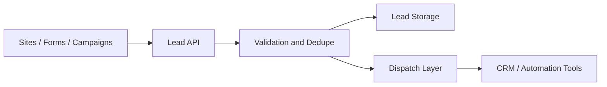

# Codestech Lead API

## Executive Summary

Codestech Lead API is a lead intake and routing case built to create more reliable continuity between websites, forms, campaigns and downstream commercial operations. The public case emphasizes product design, validation logic and operational value instead of exposing production implementation. It demonstrates how an integration layer can become a real product asset.

## Business Context

Many lead capture setups depend on fragile direct webhooks, CRM-specific handlers or disconnected form logic. This increases duplication risk, routing inconsistency and operational friction for teams that need cleaner commercial intake.

## Product Challenge

The challenge was to frame lead intake not as a technical endpoint only, but as a product layer that standardizes validation, protects downstream systems and supports more predictable integration behavior.

## Product Response

The API is positioned as a stable first-entry layer for incoming leads. It validates payloads, applies anti-duplication logic and dispatches clean data into downstream workflows such as CRM, webhooks or automation tools.

## High-Level Architecture

## Target Users

- Marketing and growth operations
- CRM-driven sales teams
- Implementation projects connecting websites and automations

## Key Features

- Centralized lead intake
- Payload validation
- Anti-duplication logic
- Downstream dispatch to automation tools or CRMs
- Consistent response handling

## Tech Stack

- Frontend: not applicable
- Backend: Python, FastAPI
- Database: PostgreSQL
- Automation / AI: Make, n8n, webhooks, `to be confirmed`
- Deploy: `to be confirmed`

## Product Role

Adriano's role in this case is positioned across:

- Product Owner
- Founder / Product Builder
- Functional Architect
- Backlog and roadmap owner
- AI workflow designer
- Documentation and implementation lead

## Business Value

This case demonstrates how an API product can reduce lead-loss risk, improve routing predictability and decrease operational noise caused by inconsistent intake patterns.

## Expected Impact / Projected KPIs

- Improve lead response consistency
- Reduce duplicate processing friction
- Shorten discovery-to-action cycles in lead handoff
- Support cleaner CRM and automation routing
- Target metric to be validated: reduce duplicate lead handling overhead after implementation review

## Status

Production

## Roadmap

- Expand client-facing implementation templates
- Confirm which sanitized flow screenshots can be made public
- Extend operational reporting and integration catalog

## Screenshots / Demo

To be added.

## Confidentiality Note

This public case study does not include private source code, credentials, production data, internal endpoints or client-sensitive information.
