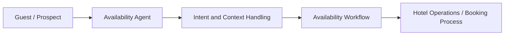

# NewHotel Availability Agent

## Executive Summary

NewHotel Availability Agent is a hospitality-focused AI case structured around availability requests, triage quality and operational response readiness. The public documentation focuses on the business need, product challenge and expected impact of an AI-assisted service layer in hospitality. It is intentionally presented at a high level, without exposing internal integrations or operational details.

## Business Context

Hospitality teams frequently deal with repetitive availability inquiries that require speed, clarity and coordination across booking-adjacent workflows. When this process is slow or fragmented, the guest experience and commercial responsiveness both suffer.

## Product Challenge

The challenge was to structure an AI-assisted interaction layer that improves intake and triage quality while remaining aligned with hospitality operations instead of functioning as a disconnected chatbot.

## Product Response

The solution frames the agent as an intake and triage layer that helps capture request context, support routing and prepare more consistent operational follow-up around availability-related interactions.

## High-Level Architecture

## Target Users

- Hotel front-desk teams
- Reservation and commercial staff
- Hospitality operators evaluating AI-assisted workflows

## Key Features

- Availability request intake
- AI-assisted triage
- Hospitality workflow alignment
- Operational handoff support

## Tech Stack

- Frontend: `to be confirmed`
- Backend: Python, `to be confirmed`
- Database: `to be confirmed`
- Automation / AI: AI agents, prompt workflows, hospitality integrations, `to be confirmed`
- Deploy: `to be confirmed`

## Product Role

Adriano's role in this case is positioned across:

- Product Owner
- Founder / Product Builder
- Functional Architect
- Backlog and roadmap owner
- AI workflow designer
- Documentation and implementation lead

## Business Value

This case shows how AI can support faster service cycles, better request organization and more structured hospitality operations without exposing implementation specifics.

## Expected Impact / Projected KPIs

- Shorten discovery-to-action cycles
- Improve operational visibility
- Support more consistent request triage
- Reduce friction in availability-response flows
- Target metric to be validated: reduce manual request interpretation time after pilot validation

## Status

Prototype

## Roadmap

- Confirm integration boundaries with hotel systems
- Add sanitized demo screenshots
- Expand measurable service KPIs

## Screenshots / Demo

To be added.

## Confidentiality Note

This public case study does not include private source code, credentials, production data, internal endpoints or client-sensitive information.
