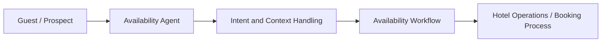

# NewHotel Availability Agent

## Overview

NewHotel Availability Agent is a hospitality-focused AI product case aimed at improving how availability requests are received, interpreted and routed.

## Problem

Hotel and hospitality teams often face repetitive availability inquiries that require speed, accuracy and coordination with internal booking processes.

## Solution

The agent layer is designed to structure incoming requests, support triage and help teams respond with better consistency and context.

## Target Users

- Hotel front-desk teams
- Reservation and commercial staff
- Hospitality operators evaluating AI-assisted workflows

## Key Features

- Availability request intake
- AI-assisted triage
- Hospitality workflow alignment
- Operational handoff support

## Product Architecture

## Tech Stack

- Frontend: to be confirmed
- Backend: Python, to be confirmed
- Database: to be confirmed
- Automation / AI: AI agents, prompt workflows, hospitality integrations, to be confirmed
- Deploy: to be confirmed

## My Role

- Product Owner
- Founder / Product Builder
- Functional Architect
- Backlog and roadmap owner
- AI workflow designer
- Documentation and implementation lead

## Business Value

Supports faster response cycles, better operational organization and a more modern hospitality service layer.

## Status

Prototype

## Roadmap

- Confirm integration boundaries with hotel systems
- Add sanitized demo screenshots
- Expand measurable service KPIs

## Screenshots / Demo

To be added.

## Confidentiality Note

This public case study does not include private source code, credentials, production data or client-sensitive information.
