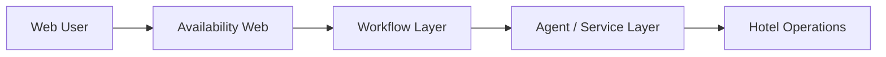

# NewHotel Availability Web

## Overview

NewHotel Availability Web is the web-facing complement to the availability workflow, providing a structured interface for hospitality-related request handling and user interaction.

## Problem

Hospitality workflows benefit from a dedicated web layer when users and operators need clearer visibility, handoff and interaction paths than messaging-only channels can provide.

## Solution

This web case adds a front-end experience around availability-related workflows, potentially supporting forms, guided input and operational visibility.

## Target Users

- Hospitality prospects and guests
- Reservation teams
- Internal operators

## Key Features

- Guided availability interaction
- Web-based entry point for hospitality workflows
- Interface support for agent or service operations

## Product Architecture

## Tech Stack

- Frontend: Next.js, React, TypeScript
- Backend: to be confirmed
- Database: to be confirmed
- Automation / AI: to be confirmed
- Deploy: Vercel, to be confirmed

## My Role

- Product Owner
- Founder / Product Builder
- Functional Architect
- Backlog and roadmap owner
- AI workflow designer
- Documentation and implementation lead

## Business Value

Creates a more presentable and scalable interface for hospitality workflows that may later connect to deeper automation or availability services.

## Status

Prototype

## Roadmap

- Confirm target user flow and production scope
- Add sanitized UI screenshots
- Connect the web layer narrative to measurable booking or inquiry outcomes

## Screenshots / Demo

To be added.

## Confidentiality Note

This public case study does not include private source code, credentials, production data or client-sensitive information.
