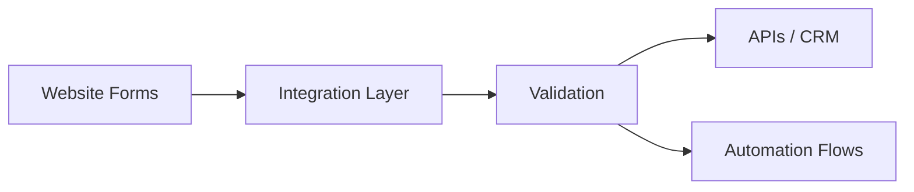

# Site Integration Project

## Overview

Site Integration Project is a public case study for website-to-operations integration work connecting forms, lead pipelines, APIs and automation tooling.

## Problem

Websites frequently collect intent but fail in handoff, creating gaps between marketing capture and operational follow-through.

## Solution

This case represents an integration pattern where website events and form submissions are normalized, routed and attached to backend or CRM workflows.

## Target Users

- Businesses running lead capture websites
- Implementation teams
- Operations teams that depend on clean handoff

## Key Features

- Website form integration
- API-first routing
- CRM and automation handoff
- Reduced manual intervention

## Product Architecture

## Tech Stack

- Frontend: HTML, CSS, JavaScript, to be confirmed
- Backend: APIs, webhooks, to be confirmed
- Database: to be confirmed
- Automation / AI: Make, n8n, CRM integrations, to be confirmed
- Deploy: to be confirmed

## My Role

- Product Owner
- Founder / Product Builder
- Functional Architect
- Backlog and roadmap owner
- AI workflow designer
- Documentation and implementation lead

## Business Value

Improves conversion handoff quality and gives website traffic a more dependable operational destination.

## Status

To be confirmed

## Roadmap

- Confirm which implementation scenario should be highlighted publicly
- Add sanitized architecture diagram variants
- Add before/after integration narrative

## Screenshots / Demo

To be added.

## Confidentiality Note

This public case study does not include private source code, credentials, production data or client-sensitive information.
