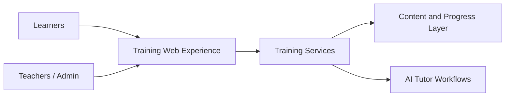

# Schoolia Training OS

## Overview

Schoolia Training OS is an EdTech-oriented product case focused on structured AI training journeys, guided learning experiences and operational tooling for course delivery.

## Problem

Training initiatives often struggle with fragmented content delivery, inconsistent learner support and limited operational visibility for instructors or managers.

## Solution

The product combines training routes, student-facing learning flows, tutor assistance and operational administration in a single learning-oriented system.

## Target Users

- Students and learners
- Instructors and training managers
- Organizations running AI literacy or skills programs

## Key Features

- Guided training journeys
- Student registration and access flows
- AI-assisted tutor experience
- Admin and teacher operational views
- Course, lesson and progress structure

## Product Architecture

High-level flow: learner interfaces connect to training services, which coordinate content, tutor assistance and operational data.

## Tech Stack

- Frontend: React, Next.js, TypeScript, to be confirmed
- Backend: FastAPI, Python, to be confirmed
- Database: PostgreSQL, to be confirmed
- Automation / AI: OpenAI, tutor workflows, to be confirmed
- Deploy: Vercel, Render, to be confirmed

## My Role

- Product Owner
- Founder / Product Builder
- Functional Architect
- Backlog and roadmap owner
- AI workflow designer
- Documentation and implementation lead

## Business Value

Creates a structured path for AI training delivery while reducing friction between content, learner support and operational coordination.

## Status

MVP

## Roadmap

- Confirm production-ready authentication model
- Expand persistent progress and analytics
- Deepen tutor context with published materials and richer AI support

## Screenshots / Demo

To be added.

## Confidentiality Note

This public case study does not include private source code, credentials, production data or client-sensitive information.
