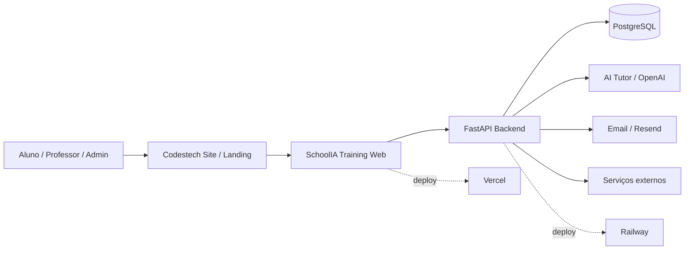

# SchoolIA Training OS — Engineering Case Study

**Status:** MVP em evolução  
**Última atualização:** 2 de setembro de 2026  
**Objetivo deste documento:** apresentar a SchoolIA como case técnico público para avaliação por Tech Leads, Engineering Managers, parceiros e investidores, sem expor código privado, credenciais, dados de produção ou endpoints internos.

## Executive Engineering Summary

A SchoolIA é uma plataforma EdTech orientada a produto, construída como uma escola digital com frontend web, backend de serviços, persistência de dados, gestão de cursos, autenticação, fluxos de aluno/professor/admin, tutor com IA e camada comercial.

O produto não é apenas um portal de aulas. A arquitetura foi evoluindo para suportar:

- múltiplos cursos;
- matrícula e acesso configuráveis;
- área do aluno;
- gestão por professor;
- gestão administrativa;
- materiais e sessões;
- quizzes e progresso;
- tutor IA contextual;
- recuperação de acesso;
- integração com fluxo comercial;
- implantação contínua em infraestrutura cloud.

A implementação está distribuída entre três componentes principais:

| Componente | Responsabilidade principal | Tecnologia / ambiente |
|---|---|---|
| `v0-treinamentoweb-v2-frontend` | experiência web do aluno, professor e gestão | Next.js / TypeScript / Vercel |
| `codestech-mini-api` | regras de negócio, autenticação, cursos, alunos, progresso, tutor e serviços backend | Python / FastAPI / Railway |
| `codestech-site` | entrada pública, páginas comerciais e integração com aquisição/matrícula | Web frontend / Vercel |

Os repositórios de implementação permanecem privados. Este case documenta decisões, arquitetura, incidentes e práticas de entrega de forma public-safe.

---

## 1. Product & Engineering Problem

O problema técnico principal foi transformar uma experiência inicialmente centrada em treinamento em uma plataforma reutilizável para diferentes cursos e operações.

Isso exigiu sair de fluxos rígidos e evoluir para uma arquitetura que pudesse tratar curso, módulo, sessão, aluno, professor e regras comerciais como entidades configuráveis.

Os principais desafios de engenharia foram:

1. separar frontend e backend sem perder consistência de autenticação e sessão;
2. suportar diferentes perfis de utilizador e permissões;
3. manter contexto correto do aluno dentro de curso, módulo e sessão;
4. introduzir IA sem misturar contexto entre alunos ou cursos;
5. migrar estruturas de dados sem interromper produção;
6. integrar matrícula, recuperação de senha e envio de comunicação;
7. evoluir funcionalidades comerciais sem quebrar a operação já ativa;
8. tratar regressões de deploy de maneira reversível.

---

## 2. High-Level Architecture


```mermaid
flowchart LR
    U[Aluno / Professor / Admin] --> SITE[Codestech Site / Landing]
    SITE --> WEB[SchoolIA Training Web]
    WEB --> API[FastAPI Backend]
    API --> DB[(PostgreSQL)]
    API --> AI[AI Tutor / OpenAI]
    API --> MAIL[Email / Resend]
    API --> EXT[Serviços externos]

    WEB -. deploy .-> V[Vercel]
    API -. deploy .-> R[Railway]
```

### Responsibility boundaries

**Frontend**

- renderização da experiência do aluno;
- navegação por curso, módulo e sessão;
- interfaces de professor e gestão;
- configuração comercial de cursos;
- recuperação de acesso;
- consumo das APIs do backend.

**Backend**

- autenticação e autorização;
- regras de matrícula e acesso;
- persistência de cursos e alunos;
- materiais, sessões e quizzes;
- progresso;
- tutor contextual;
- regras comerciais;
- integração de email;
- rotinas de migração e manutenção controlada.

**Site público**

- aquisição;
- landing pages;
- entrada para cursos;
- fluxos de cadastro/matrícula;
- integração entre marketing e produto.

---

## 3. Engineering Decisions

### 3.1 Frontend e backend desacoplados

A separação entre aplicação web e API permite que a SchoolIA evolua interfaces e regras de negócio independentemente.

Benefícios:

- frontend pode ser publicado separadamente;
- backend centraliza regras de negócio;
- possibilidade futura de apps móveis, WhatsApp ou clientes B2B consumirem a mesma API;
- menor acoplamento entre UX e persistência.

### 3.2 FastAPI como camada de serviços

O backend Python/FastAPI concentra autenticação, gestão de cursos, alunos, conteúdo e integrações.

A escolha favorece:

- APIs REST claras;
- integração com workloads de IA;
- evolução incremental;
- implementação rápida de serviços administrativos e automações.

### 3.3 Estrutura multi-curso

A plataforma evoluiu de fluxos específicos para uma estrutura comercial configurável.

A Sprint 1 introduziu uma camada reutilizável para cursos gratuitos, freemium e pagos, incluindo regras de acesso e metadata comercial.

A Sprint 2 avançou para cadastro público configurável, matrícula por curso e catálogo comercial.

### 3.4 Context isolation no tutor IA

O tutor deve operar no contexto do aluno e do conteúdo correto.

A arquitetura considera separação por:

- aluno;
- curso;
- módulo;
- sessão;
- materiais publicados.

Esse isolamento é essencial para evitar vazamento de contexto, respostas baseadas em conteúdo incorreto e cache compartilhado indevidamente.

### 3.5 Deploy reversível

Mudanças de produção são tratadas como incrementos reversíveis. Quando uma alteração compromete o runtime, a prioridade é restaurar a última árvore saudável antes de continuar a investigação.

Esse princípio foi aplicado em produção em 2 de setembro de 2026.

---

## 4. Production Incident & Recovery Case

### Contexto

Em 2 de setembro de 2026, a Sprint 2 do backend foi integrada com funcionalidades de:

- cadastro público configurável;
- matrícula por curso;
- catálogo comercial;
- validação automatizada.

Commit de integração:

`cd64566 — Sprint 2: entrada autônoma e matrícula configurável (#556)`

Após o deploy, foi identificada uma falha de runtime no ambiente Railway.

### Decisão

Em vez de continuar alterando produção sobre uma base instável, foi executado rollback para a última árvore saudável.

Commit de recuperação:

`5995135 — Revert Sprint 2 após falha de runtime no Railway (#557)`

### Por que esse caso importa

O incidente demonstra uma prática importante de engenharia:

1. mudança isolada em sprint;
2. implantação;
3. identificação de regressão em runtime;
4. contenção do impacto;
5. rollback explícito;
6. preservação da versão saudável;
7. investigação posterior sem manter produção degradada.

O objetivo não é apresentar ausência de falhas, mas demonstrar capacidade de detectar, conter e reverter uma regressão de produção.

---

## 5. Additional Production Engineering Evidence

O histórico recente do backend registra outras evoluções operacionais relevantes.

### Recuperação de senha

Foram implementados fluxos para recuperação por telefone ou email, exigindo coordenação entre frontend, backend e email transacional.

### Matrícula transacional

O fluxo de registro do curso CAM foi evoluído para evitar falso positivo de ativação. A confirmação passou a depender da conclusão efetiva da matrícula e do retorno das etapas necessárias.

### Email de boas-vindas

A ativação passou a integrar envio de email por serviço transacional, tornando a comunicação parte observável do fluxo de onboarding.

### Performance

Foi removido um padrão de consultas repetitivas no dashboard do aluno, substituído por contagens em lote para evitar uma query por sessão.

### Auditoria de conteúdo

O banco de questões CAM passou por ciclos conservadores de auditoria, correção e quarentena de questões consideradas duvidosas. A abordagem privilegiou retirar temporariamente conteúdo incerto em vez de mantê-lo ativo sem confiança suficiente.

---

## 6. Authentication & Access Model

A SchoolIA possui diferentes superfícies de autenticação e autorização para:

- aluno;
- professor;
- administração/gestão.

A evolução recente inclui:

- login;
- recuperação de senha;
- sessão protegida;
- permissões por perfil;
- acesso do professor aos seus alunos;
- gestão administrativa;
- controle de acesso baseado no curso/matrícula.

A direção técnica é manter autenticação centralizada no backend e evitar que regras críticas existam apenas no frontend.

---

## 7. Data Model Direction

O domínio principal é organizado em torno de uma hierarquia semelhante a:

```text
Course
└── Level
    └── Module
        └── Session
            ├── Material
            ├── Quiz / Questions
            └── Tutor Context

Student
└── Enrollment
    └── Course Access
        ├── Progress
        ├── Responses
        └── Tutor Interaction
```

A plataforma vem passando por transição de estruturas legadas para uma árvore de conteúdo mais explícita. Durante essa evolução, compatibilidade e migração de dados precisam ser tratadas cuidadosamente para evitar divergência entre materiais antigos e novos relacionamentos.

---

## 8. AI Tutor Engineering

O tutor IA é tratado como serviço contextual da plataforma, não como um chatbot genérico.

### Context inputs

O comportamento esperado considera:

- utilizador autenticado;
- curso matriculado;
- módulo atual;
- sessão atual;
- materiais associados;
- histórico pertinente.

### Engineering concerns

Os principais riscos técnicos monitorados são:

- mistura de contexto entre alunos;
- seleção incorreta da sessão atual;
- materiais legados vs. nova árvore de conteúdo;
- cache sem isolamento suficiente;
- consumo excessivo de tokens;
- latência;
- respostas fora do material do curso.

### Direction

A direção é manter o tutor subordinado ao contexto pedagógico e às permissões do utilizador, em vez de permitir acesso irrestrito ao domínio inteiro da plataforma.

---

## 9. Delivery & CI/CD Model

### Frontend

- GitHub como source control;
- branches e pull requests para evolução;
- Vercel como plataforma de deploy web.

### Backend

- GitHub como source control;
- FastAPI;
- Railway como runtime;
- configuração de ambiente separada do código;
- migrações controladas;
- rollback por commit quando necessário.

### Delivery pattern

```text
Feature / Fix
   ↓
Branch / PR
   ↓
Review / validation
   ↓
Merge
   ↓
Deploy
   ↓
Runtime verification
   ↓
Keep OR Rollback
```

---

## 10. Testing Strategy — Current State

A cobertura automatizada ainda está em evolução e não deve ser apresentada como madura.

Já existem validações automatizadas associadas a mudanças recentes, mas a direção recomendada é consolidar uma suíte que cubra prioritariamente:

1. autenticação;
2. recuperação de senha;
3. autorização por perfil;
4. matrícula;
5. regras comerciais;
6. acesso aluno → curso;
7. progresso;
8. tutor/context isolation;
9. migrações de banco;
10. smoke tests pós-deploy.

### Quality principle

Para os fluxos críticos, a meta não deve ser apenas testar funções isoladas, mas validar jornadas completas:

```text
Cadastro → Matrícula → Login → Curso → Sessão → Quiz → Progresso → Tutor
```

---

## 11. Security Considerations

O case público não expõe:

- código de produção;
- tokens;
- secrets;
- chaves de API;
- credenciais de banco;
- dados de alunos;
- endpoints administrativos internos.

Princípios adotados ou previstos para evolução:

- secrets via environment variables;
- autorização server-side;
- cookies/sessões protegidos;
- separação de ambientes;
- menor privilégio possível;
- revisão de endpoints temporários de manutenção;
- remoção de ferramentas temporárias após uso.

Um exemplo concreto dessa disciplina foi a remoção de endpoint temporário usado durante manutenção do curso CAM após a conclusão do trabalho.

---

## 12. Observability & Operational Maturity

A experiência do incidente da Sprint 2 reforçou a necessidade de aumentar observabilidade.

Próximos elementos recomendados:

- health checks claros;
- structured logging;
- correlação por request ID;
- error tracking;
- métricas de latência;
- métricas de falha por endpoint;
- smoke tests pós-deploy;
- alertas de runtime;
- dashboards básicos de disponibilidade.

A plataforma já utiliza logs de infraestrutura para investigação, mas essa camada deve evoluir para observabilidade de aplicação mais estruturada.

---

## 13. Technical Debt & Known Risks

Os principais pontos de atenção atuais são:

| Risco | Impacto | Direção |
|---|---|---|
| Cobertura automatizada ainda parcial | regressões | ampliar testes de jornadas críticas |
| Estruturas de conteúdo legadas e novas coexistindo | inconsistência | consolidar modelo de materiais/sessões |
| Tutor depende de resolução correta de contexto | resposta incorreta | reforçar isolation e testes |
| Migrações de produção | indisponibilidade / dados inconsistentes | tornar migrações idempotentes e verificáveis |
| Observabilidade limitada | diagnóstico mais lento | logs estruturados + métricas + error tracking |
| Crescimento de responsabilidades no backend | acoplamento | separar serviços/domínios conforme escala |

---

## 14. Engineering Roadmap

### P0 — Reliability

- resolver causa raiz da regressão da Sprint 2;
- restabelecer a funcionalidade de matrícula configurável com deploy seguro;
- adicionar smoke tests de produção;
- formalizar health checks;
- consolidar logging de erros.

### P1 — Quality

- testes de autenticação e autorização;
- testes de matrícula;
- testes de progressão;
- testes de isolamento do tutor;
- teste automatizado de migrações.

### P2 — Architecture

- consolidar árvore Course → Module → Session → Material;
- reduzir compatibilidade legada;
- separar serviços que crescerem além do domínio central;
- documentar contratos principais da API.

### P3 — Scale

- métricas de produto e infraestrutura;
- rate limiting;
- filas para tarefas assíncronas quando necessário;
- cache controlado por tenant/aluno/contexto;
- estratégia formal de backups e recuperação.

---

## 15. What This Case Demonstrates

A SchoolIA é utilizada neste portfólio como principal evidência de capacidade para trabalhar na interseção de produto e engenharia.

O case demonstra:

- definição e evolução de produto real;
- decomposição frontend/backend;
- APIs e integrações;
- autenticação e autorização;
- modelagem de domínio EdTech;
- integração de IA contextual;
- operação em cloud;
- CI/CD incremental;
- migração de dados;
- debugging de produção;
- rollback;
- gestão de dívida técnica;
- priorização de confiabilidade antes de novas features.

## Role

**Adriano Corrêa** atua no projeto na interseção entre:

- Product Ownership;
- arquitetura funcional;
- definição de backlog e roadmap;
- desenho de fluxos;
- validação técnica assistida;
- IA aplicada ao produto;
- coordenação de implantação;
- investigação de incidentes;
- documentação técnica e executiva.

A execução utiliza desenvolvimento assistido por IA e ferramentas de engenharia, com decisões de produto, validação funcional, priorização e coordenação de entrega centralizadas no Product Owner/Founder.

---

## Public / Private Boundary

Este documento é intencionalmente documentation-first.

Os repositórios reais de implementação permanecem privados para proteger propriedade intelectual, credenciais e dados operacionais. Evidências públicas são apresentadas por arquitetura, histórico de engenharia, decisões, incidentes, status e resultados, sem publicar ativos sensíveis.
