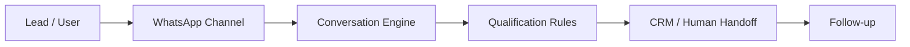

# WhatsBot AI

## Executive Summary

WhatsBot AI is a conversational automation case designed for structured response, qualification and operational handoff in messaging environments. The public case focuses on product reasoning, high-level workflow design and business value rather than implementation detail. It presents a reusable model for reducing friction in lead and service conversations.

## Business Context

Teams operating through WhatsApp and similar channels often face inconsistent first response, repeated manual triage and poor continuity between conversation, qualification and action. This creates delays, missed opportunities and unnecessary operational noise.

## Product Challenge

The challenge was to organize a conversational product layer that could support business rules, qualification logic, automation and human handoff without collapsing into a generic chatbot pattern.

## Product Response

The solution frames WhatsBot AI as a conversation engine with routing rules, AI-assisted flows and integration readiness. Instead of treating messaging as a standalone channel, the case treats it as an operational entry layer connected to qualification and follow-up logic.

## High-Level Architecture

## Target Users

- Sales and lead generation teams
- Support and service operations
- Training or onboarding flows using conversational channels

## Key Features

- WhatsApp-oriented intake workflows
- Lead qualification and routing logic
- Multi-product operating model
- Conversation logging and guardrails
- Integration-ready service layer

## Tech Stack

- Frontend: `to be confirmed`
- Backend: Python, FastAPI
- Database: PostgreSQL, `to be confirmed`
- Automation / AI: OpenAI, WhatsApp APIs, Make/n8n, `to be confirmed`
- Deploy: Render, Cloudflare, `to be confirmed`

## Product Role

Adriano's role in this case is positioned across:

- Product Owner
- Founder / Product Builder
- Functional Architect
- Backlog and roadmap owner
- AI workflow designer
- Documentation and implementation lead

## Business Value

This case demonstrates how conversational automation can improve operational consistency, create cleaner qualification logic and support better transition from channel interaction to business action.

## Expected Impact / Projected KPIs

- Reduce manual follow-up friction
- Improve lead response consistency
- Support more structured routing and handoff
- Increase operational visibility across conversations
- Target metric to be validated: reduce manual triage time by up to X% after pilot validation

## Status

In development

## Roadmap

- Confirm final channel and tenant strategy
- Expand automation and CRM routing depth
- Add more role-based operational reporting

## Screenshots / Demo

To be added.

## Confidentiality Note

This public case study does not include private source code, credentials, production data, internal endpoints or client-sensitive information.
