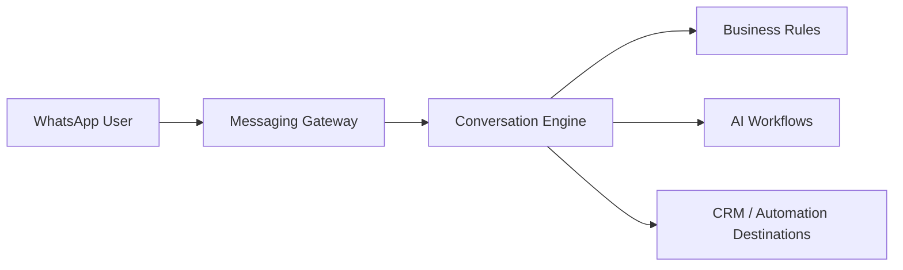

# WhatsBot AI

## Overview

WhatsBot AI is a conversational automation case designed for WhatsApp-centered service, lead qualification and guided response workflows.

## Problem

Teams handling high volumes of inbound conversations need consistent triage, faster first response and better routing into sales, support or learning processes.

## Solution

The solution uses a conversation engine with business rules, contextual flows and integration-ready architecture to support automated and assisted responses.

## Target Users

- Sales and lead generation teams
- Support and service operations
- Training or onboarding flows using conversational channels

## Key Features

- WhatsApp-oriented intake workflows
- Lead qualification and routing logic
- Multi-product operating model
- Conversation logging and guardrails
- Integration-ready service layer

## Product Architecture

## Tech Stack

- Frontend: to be confirmed
- Backend: Python, FastAPI
- Database: PostgreSQL, to be confirmed
- Automation / AI: OpenAI, WhatsApp APIs, Make/n8n, to be confirmed
- Deploy: Render, Cloudflare, to be confirmed

## My Role

- Product Owner
- Founder / Product Builder
- Functional Architect
- Backlog and roadmap owner
- AI workflow designer
- Documentation and implementation lead

## Business Value

Improves response consistency, reduces manual load and creates a cleaner bridge between conversation channels and operational systems.

## Status

In development

## Roadmap

- Confirm final channel and tenant strategy
- Expand automation and CRM routing depth
- Add more role-based operational reporting

## Screenshots / Demo

To be added.

## Confidentiality Note

This public case study does not include private source code, credentials, production data or client-sensitive information.
