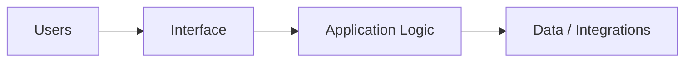

# Project Name

## Overview

Describe the project in clear professional language.

## Problem

Explain the real-world problem being addressed.

## Solution

Describe how the solution works at a high level.

## Target Users

- Primary users
- Secondary users
- Buyers or internal stakeholders

## Key Features

- Feature 1
- Feature 2
- Feature 3
- Feature 4

## Product Architecture

Explain the architecture in high-level terms only.

## Tech Stack

- Frontend: to be confirmed
- Backend: to be confirmed
- Database: to be confirmed
- Automation / AI: to be confirmed
- Deploy: to be confirmed

## My Role

- Product Owner
- Founder / Product Builder
- Functional Architect
- Backlog and roadmap owner
- AI workflow designer
- Documentation and implementation lead

## Business Value

Explain the business value, operational gains or strategic value.

## Status

Choose one: `concept`, `prototype`, `MVP`, `in development`, `homologation`, `production`

## Roadmap

- Next step 1
- Next step 2
- Next step 3

## Screenshots / Demo

To be added.

## Confidentiality Note

This public case study does not include private source code, credentials, production data or client-sensitive information.
